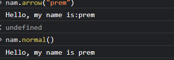
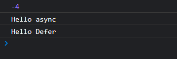

# Day 1 Assignment

- garbage collector
- difference between arrow func and statement func. (binding)
- hoisting
- tdg (temporal dead zone)
- script tag attributes
- script tag async and defer
- reduce function

### Garbage Collection

garbage collector is used to monitor memory allocation and determine when a block of allocated memory is no longer needed and reclaim it for further use. Garbage collection works by using references. If a object doesn't have any other object refering to it, then is is considered as garbage.

let x = {

    a: {
        b: [1,2,3,4]
    }

};

x = 4

since, a doesn't have any variable referencing it, then it may be considered as garbage.

### Difference between arrow function and statement function.

The main difference between the arrow function and statement function in accordance with binding is: with statement functions the this keyword is bound to different values based on the context in which it is called.

In arrow function, it uses this from the code that contains the arrow function (Basically it gets this from the parent function).

### Hoisting.

Hoisting is the process where the interpreter moves the declared functions, variables and classes to the top of the scope.

The variables declared with let and const are hoisted to the top of the block but are not initialized and with var the declaration is hoisted to the top and not the value as well.

### Temporal Dead Zone.

Temporal Dead Zone is the area in the block ({...}) where a variable is not accessible until the variable has been initializes. It's the area before the variable has been initialized inside a block.

### Script tag atrributes.

script tag contains many atrributes such as defer(execute after the parsing), async(execute as soon as available), src(url to the file), type(specifies the type of media),
crossorgin(set the mode of request), integrity (code doesn't load if the source is changed), nomodule (specifying the module range), referrerpolicy (which information to send).

### defer and async.

Defer is a boolean attribute which executes the page after the document has been parsed.

while async executes the script as soon as its available.

### reduce function

