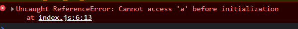
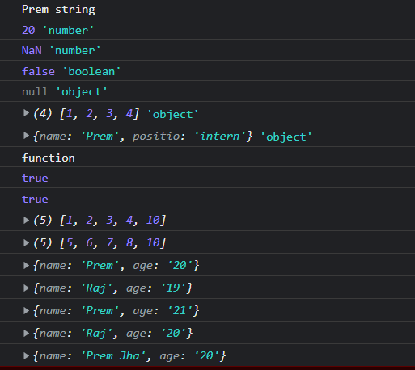

# Assignment 2

Console.log after assigning the value using let.

.png>)

Console.log before assigning the value using let.

.png>)

Console.log before assigning the value using const.

Typeof output

> How can you find if a variable is an array or NaN besides typeof?

- Using is isNaN and Array.isArray we can find out if the variable is an Nan or an array.

> What actually happens in both cases?

- With both let and const we are able to change the content of the object and array.

> What is the difference between an object declared as a let or a const variable?

- With const the object can't be changed while with let the object can be alerted.
