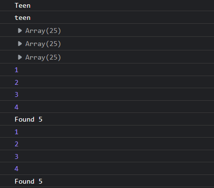

# Assignment 3

1. Declare a variable let age = 25;. Write a series of if else statements that will:

   Print child to the console if age is less than equal to 12.

   Print teen to the console if age is between 13 and 18 (inclusive).

   Print adult to the console if age is above 18.

2. Do the same using switch case.

3. Declare a variable let arraySize = 25;. Using a for loop, add numbers from one onwards into an array till the arraySize is reached.

4. Accomplish the same using a while loop.

5. Can you use return instead of break in loops?

## Output

